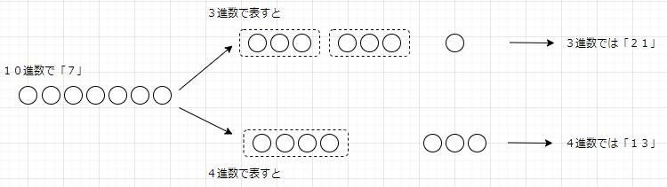

# そもそもN進数とは
 
 N進数とはＮ個の記号を用いて個数を表現する手法です。
 
 
 普段私たちがよく使うのは１０進数です。 
 例えば、「５９６７」という数があったら、私たちは「ご　せん　きゅう　ひゃく　ろく　じゅう　なな」と読みます。
 これは、千の位に５、百の位に９、十の位に６、一の位に７が含まれているということを表しています。
 そして、０～９の数字を使って、それぞれの位の中が十に達すると次の上の位に桁上りするルールですね。位とそこに含まれる数字をかけた値がその数字の表す値になります。
 
 
 箱を使ってイメージしてみましょう。
 
 
 ３進数だったら 0, 1, 2 の３つの記号を用いて個数を表すという感じです。個数が３つになったら桁上りをします。 
 ４進数だったら 0, 1, 2, 3 の４つの記号を用いて個数を表して、個数が４つになったら桁上りをします。
 
 
 
 
ちなみに、この箱に入る〇の最大の数を重みといいます。この箱の重み付けの基本となる数が基数です。基数はＮ進数のＮの部分の数で、上の位に桁上りをすると箱の重みはＮ倍、下の位に桁下りをすると箱の重みはＮ分の１になります。

つまり、

* N進数は０から(N-1)までのＮ個の記号を用いて個数を表していて、
* 右からｘ桁にはN(ｘ-1)の重みの箱がＮ個ずつあり、
* 各箱の中に含まれる数字を足した数が表す値になる、

なんていうこともできますね。
 
 

 # １６進数だとどうなる？

では１６進数だとどう表されるのでしょうか。

まず、１６進数なので基数は１６。０から１５までの１６個の数字で表されます。って「１５（じゅうご）」だと重みが十の箱に１があるってことだから１０進数の表記になっちゃいますね！
そこで０～９までは普段通りなんですが、１０進数でいう１０～１６の部分をA～Fで表します。
つまり、1  2  3  4  5  6  7  8  9　A B  C  D  E  F で表されるってことですね。 

次に箱には右から１、１６，２５６、４０９６の重みがつきます。 

そして値は各箱の中に含まれる数字を足した数が表す値になるので、例えば「B7A」は１６進数で表されてますが、１０進数だったら２５６×１１＋１６×７＋１×１０＝２９３８と表されます。

# なぜ１６進数なのか

プログラムを書くときに利用するのが２進数と１６進数だからです。
コンピュータは、基本的に２進数で演算を行っていています。ですが２進数だと０と１だけでわかりずらいので、基数が２のべき乗である１６進数を使っているんだそうです。

ここの結びつきについてはまだよくわからないので随時更新していく予定です。

※ 基数の説明もあった方がいいかも？
